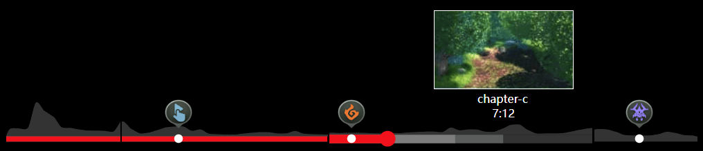

# PPBar

[](https://github.com/web-streaming/ppbar) 
[](https://github.com/web-streaming/ppbar) 

A powerful player progress bar that supports chapters, markers, heatmaps, thumbnails, live broadcasts, rotations, and more. It also supports custom UI, which can be made into the appearance of the player progress bar of Youtube or Bilibili.

If you like PPBar, please give it a Star⭐️ to encourage the author.

[](https://web-streaming.github.io/ppbar/)

[中文文档](./README_zh.md)

## Install

```
npm i ppbar
```

or via CDN

```html
<link rel="stylesheet" href="https://unpkg.com/ppbar@latest/dist/index.min.css">

<script src="https://unpkg.com/ppbar@latest/dist/index.min.js"></script>

<script>
  console.log(ppbar)
</script>
```

## Usage

The first step is to import the `ProgressBar` class and the style of ppbar.

```js
import ProgressBar from 'ppbar';
import 'ppbar/dist/index.min.css';

const div = document.createElement('div');
const bar = new ProgressBar(div, {
  // config
})

document.body.appendChild(div)
```

The `ProgressBar` constructor accepts two parameters, the first is its container, and the second is the config for ppbar. Setting the first parameter will automatically add the ppbar's DOM element to the incoming container.

Of course, if you want to manually add the DOM element of ppbar, you can set the first parameter to `undefined`.

```ts
import ProgressBar from 'ppbar';
import 'ppbar/dist/index.min.css';

const bar = new ProgressBar(undefined, {
  // config
})

document.body.appendChild(bar.el)
```

ppbar has an `updateConfig` method that can be used to dynamically update config at any time.

```ts
import ProgressBar from 'ppbar';
import 'ppbar/dist/index.min.css';

const bar = new ProgressBar(undefined, {
  // config
})

document.body.appendChild(bar.el)

bar.updateConfig({ /* new config */ })

// Destroy the bar object if you don't need it anymore
bar.destroy()
```

### Chapter

Chapters can set the progress bar segmentation effect. Each chapter must have a title, which will be displayed when the mouse hovers the progress bar.

Chapters should have a `time` attribute, indicating the end of the chapter, the last chapter can omit the `time` attribute.

```js
import ProgressBar from 'ppbar';
import 'ppbar/dist/index.min.css';

new ProgressBar(document.body, {
  chapters: [
    { time: 10, title: 'chapter1' },
    { time: 20, title: 'chapter2' },
    { title: 'chapter3' },
  ]
})
```

A total of 3 chapters are set above.

1. `0s - 10s` chapter1
2. `10s - 20s` chapter2
3. `20s - duration` chapter3

### Marker

Markers allow you to place markers on the progress bar, each of which can be placed in a custom DOM or an image.

```ts
import ProgressBar from 'ppbar';
import 'ppbar/dist/index.min.css';

new ProgressBar(document.body, {
  markers: [
    { time: 10, title: 'marker1', image: './img.jpg', size: [30, 30] },
  ]
})
```

The above code sets a marker at the 10-second position of the progress bar. There is an image in the marker, and its size is `30x30`.

In addition to images, you can also use custom dom elements.

```ts
import ProgressBar from 'ppbar';
import 'ppbar/dist/index.min.css';

const div = document.createElement('div')

new ProgressBar(document.body, {
  markers: [
    { time: 10, title: 'marker1', el: div },
  ]
})
```

The `markerClick` event is fired when a marker is clicked.

```ts
import { EVENT, ProgressBar } from 'ppbar'

const bar = new ProgressBar(document.body, {
  markers: [
    { time: 10, title: 'marker1' },
  ]
})

bar.on(EVENT.MARKER_CLICK, (marker) => console.log(marker))
```

### HeatMap

Heatmaps are used to mark changes in the views of the entire video at different time periods. For example, the views from 0 to 5 seconds is 100, and the views from 5 to 10 seconds is 200... Then plotting these views into a curve is the heat map of ppbar.

```ts
const bar = new ProgressBar(document.body, {
  heatMap: {
    points: [1, 2, 3],
    defaultDuration： 5,
  }
})
```

The above code configuration indicates that the duration represented by each point is `5` seconds, that is, the value of `0 - 5` is `1`, the value of `5 - 10` is `2`, and the value of `10 - 15` is `3` .

In addition, it also supports to set the duration separately for each point.

```ts
const bar = new ProgressBar(document.body, {
  heatMap: {
    points: [{ duration: 10, score: 1 }, { score: 2 }, { duration: 2, score: 3 }],
    defaultDuration： 5,
  }
})
```

In the above configuration, the first and third have their own durations, and the second uses `defaultDuration`.

If you want the heatmap to be the same as Youtube, it will only be displayed on hover, you can set `hoverShow`.

```ts
const bar = new ProgressBar(document.body, {
  heatMap: {
    points: [1, 2, 3],
    defaultDuration： 5,
    hoverShow: true
  }
})
```

### Thumbnail

Thumbnails are used to preview the footage at different points in the video. A thumbnail is formed by splicing multiple small thumbnails.

```ts
const bar = new ProgressBar(document.body, {
  thumbnail: {
    start: 0, // Start time,
    gap: 10, // Single small thumbnail duration
    row: 5, // The large thumbnail is composed of several lines of small thumbnails
    col: 5, // The large thumbnail is composed of several columns of small thumbnails
    width: 160, // Single small thumbnail width
    height: 90, // Single small thumbnail height
    images: [], // Thumbnail url array
  }
})
```

The values of the above config are all default config.

Also if you don't want to show thumbnails you can set it to `false`.

```ts
const bar = new ProgressBar(document.body, {
  thumbnail: false
})
```

### Live 

It also supports live mode. In live mode, the time display of the progress bar will be a negative number.

```ts
new ProgressBar(document.body, { live: true })
```

In addition, you can use the `updateConfig` method to dynamically turn on and off the live mode.

```ts
const bar = new Progress(document.body) 

bar.updateConfig({ live: true })
```

### Rotation

ppbar also supports being rotated. For example, if you don't use full screen on the mobile side, but you want the video to be played horizontally, you will set `transform: rotate(90deg)` on the player. At this time, you need to manually update the rotation of the ppbar to prevent the ppbar interaction from failing.

```ts
const div = document.createElement('div')
div.style.transform = 'rotate(90deg)'
new ProgressBar(div, { rotate: 90 })
```

You can also dynamically update config via the `updateRotate` method.

```ts
const bar = new ProgressBar(document.body)

bar.updateRotate(90)
```

### Event

ppbar also emit events, you can use the `on` method to listen to the event, the `once` method to listen to the event once, and the `off` to cancel the event.

```ts
import { EVENT, ProgressBar } from 'ppbar'

const bar = new ProgressBar(document.body)

bar.once(EVENT.DRAGGING, console.log)
bar.on(EVENT.DRAGEND, console.log)
bar.off(EVENT.DRAGEND, console.log)
```

For specific event descriptions, please refer to [API Events Section](#api)

## Customize Theme

ppbar allows you to customize the theme.

```scss
new ProgressBar(document.body, {
  dot: '<svg>...</svg>'
})
```

The config `dot` can be used to define the dot of the progress bar, which can be a custom DOM element or a string. When it is a string, `innerHTML` will be set directly.

In addition, you can set the theme color of ppbar through CSS variables.

```ts
const bar = new ProgressBar(document.body) 

bar.el.style.setProperty('--primary-color', 'rgba(35,173,229, 1)');
```

`--primary-color` is the theme color of ppbar, default is `#f00`.

Finally, you can also customize the style through Sass variables.

```scss
@use '~ppbar/lib/index.scss' with (
  $primaryColor: #0f0,
  $markerDotBg: #f00,
  $heatMapHeight: 30px
)
```

in js file.

```ts
import ProgressBar from 'ppbar'
import './index.scss'
```

There are currently 3 custom sass variables supported.

- `$primaryColor` primary color，default `#f00`
- `$markerDotBg` marker dot background，default `#fff`
- `$heatMapHeight` heat map height，default `40px`

## Integrated into the player

You can use ppbar to build your own player, or integrate it into an existing player, take [nplayer](https://github.com/woopen/nplayer) as an example.

```ts
import ProgressBar, { EVENT as BAR_EVENT } from 'ppbar';
import Player, { EVENT } from 'nplayer';
import 'ppbar/dist/index.min.css'

const div = document.createElement('div')
div.style.width = '100%'
const progress = new ProgressBar(div, {
  chapters: [
    { time: 10, title: 'chapter-a' },
    { time: 28, title: 'chapter-b' },
    { time: 51, title: 'chapter-c' },
    { title: 'chapter-d' },
  ],
  markers: [{
    time: 15,
    title: 'title1',
    image: 'https://github.com/web-streaming/ppbar/blob/main/demo/m1.png?raw=true',
    size: [32, 34],
  }, {
    time: 30,
    title: 'title2',
    image: 'https://github.com/web-streaming/ppbar/blob/main/demo/m2.png?raw=true',
    size: [32, 34],
  },
  {
    time: 55, 
    title: 'title3', 
    image: 'https://github.com/web-streaming/ppbar/blob/main/demo/m3.png?raw=true', 
    size: [32, 34],
  }],
  heatMap: {
    points: [9592,9692,10063,41138,30485,23905,10966.5,10316.5,8533.5,7249,7181,6813,5929,18046.5,8817,3684.5],
    defaultDuration: 3.75
  },
  thumbnail: {
    images: ['https://github.com/woopen/nplayer/blob/main/website/static/img/M1.jpg?raw=true']
  }
})

const MyProgress = {
  el: div,
  init(player) {
    player.on(EVENT.DURATION_CHANGE, () => progress.updateDuration(player.duration))
    player.on(EVENT.TIME_UPDATE, () => progress.updatePlayed(player.currentTime))
    player.on(EVENT.PROGRESS, () => progress.updateBuffer(player.buffered.end(player.buffered.length - 1)))
    // Listen to player events and associate with ppbar
  }
}

const player = new Player({
  src: 'http://clips.vorwaerts-gmbh.de/big_buck_bunny.mp4',
  controls: [
    ['play', 'volume', 'time', 'spacer', 'settings', 'web-fullscreen', 'fullscreen'],
    [MyProgress]
  ]
})

progress.on(BAR_EVENT.DRAGEND, (time) => {
  player.currentTime = time
})
progress.on(BAR_EVENT.MARKER_CLICK, (marker) => {
  player.currentTime = marker.time
})
// Associate the ppbar event to the player

player.mount(document.body)
```


## API

### Config

| Name | Type | Description |
| -- | -- | -- |
| `live` | `boolean` | Whether it is live mode |
| `duration` | `number` | The duration of the progress bar |
| `rotate` | `0 \| 90 \| -90` | The number of degrees the progress bar is to be rotated |
| `dot` | `HTMLElement \| string \| true` | Progress bar dot, `true` means use the default |
| `chapters` | `{time?:number,title:string}[]` | Chapters, `time` is the end time of a chapter, the last chapter can not be set |
| `heatMap` | `Object` | heat map |
| `heatMap.points` | `(number\|{duration?:number;score:number})[]` | Heatmap Score Points |
| `heatMap.defaultDuration` | `Object` | Default single point duration |
| `heatMap.hoverShow` | `Object` | Whether to display only when hover |
| `markers` | `Object[]` | markers |
| `markers[].time` | `number` | Required, marker time |
| `markers[].title` | `string` | Marker title |
| `markers[].el` | `HTMLElement` | Marker DOM element |
| `markers[].image` | `string` | Marker image |
| `markers[].size` | `number[]` | Marker image sizes |
| `thumbnail` | `Object \| false` | Thumbnail, `false` to not display |
| `thumbnail.start` | `number` | Start time，default `0` |
| `thumbnail.gap` | `number` | Single small thumbnail duration, default `10` |
| `thumbnail.row` | `number` | The large thumbnail is composed of several lines of small thumbnails, default `5` |
| `thumbnail.col` | `number` | The large thumbnail is composed of several columns of small thumbnails, default `5` |
| `thumbnail.width` | `number` | Thumbnail width, default `160` |
| `thumbnail.height` | `number` | Thumbnail height, default `90` |
| `thumbnail.images` | `string[]` | Thumbnail url array |

### Property

| Name | Type | Description |
| -- | -- | -- |
| `el` | `HTMLElement` | DOM element of the progress bar |
| `config` | `ProgressConfig` | Progress bar config |
| `rect` | `Rect` | Progress bar rect，similar to [DOMRect](https://developer.mozilla.org/en-US/docs/Web/API/DOMRect) |
| `duration` | `number` | Duration, default `0` |
| `rotate` | `number` | Rotate, default `0` |
| `live` | `boolean` | Whether it is live mode |

### Methods

#### updateSize()

Update the size of the progress bar, which is generally called when modifying the size and position of the container to prevent misalignment of elements in the progress bar.

```ts
updateSize(): void;
```

### updateRotate()

Update the rotation degree of the progress bar.

```ts
updateRotate(r: 0 | 90 | -90): void
```

### updateDuration()

update duration.

```ts
updateDuration(duration?: number): void
```

### updateConfig()

Update the config of the progress bar. The config can be partially updated and are generally used when switching videos.

```ts
updateConfig(config?: Partial<ProgressConfig>): void
```

### updateMarkerPosition()

To update the position of the marker, it can be changed over time during the live broadcast, you can use this function. The parameter is a relative time, indicating how much time distance all markers move.

```ts
updateMarkerPosition(relativeTime: number): void
```

### updatePlayed()

Update playback progress.

```ts
updatePlayed(time: number): void
```

### updateBuffer()

Update buffer progress.

```ts
updateBuffer(time: number): void
```

### updateHover()

Update hover progress.

```ts
updateHover(time: number): void
```

### destroy()

Destroy the progress bar.

```ts
destroy(): void
```

### Event

| Name | Description |
| -- | -- |
| `markerClick` | The marker was clicked, the parameter is the marker object | 
| `dragging` | The progress bar is being dragged, frequently triggered |
| `dragend` | Drag end |
| `mousemove` | The mouse moves on the progress bar, which is triggered frequently |
| `mouseleave` | Mouse leave |
